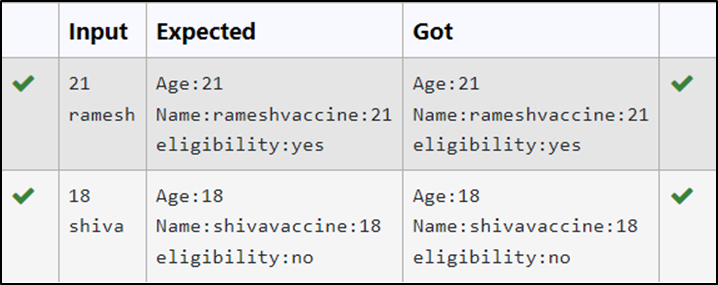
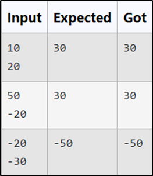
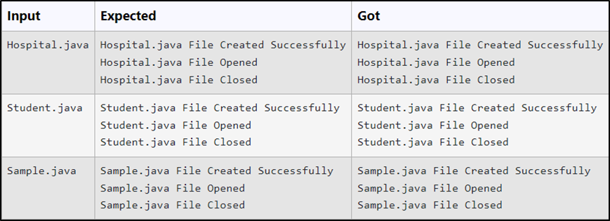
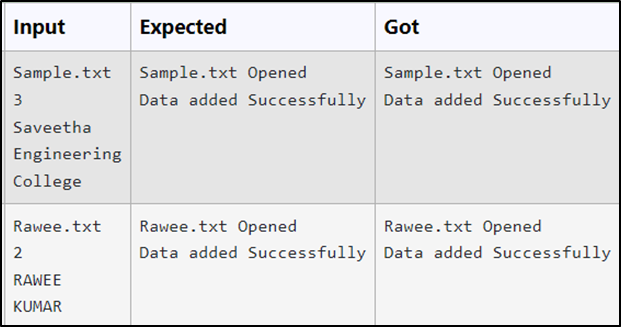

# Advanced-C-Lab-Manual
EXP NO:1A C PROGRAM FOR ARRAY OF STRUCTURE TO CHECK ELIGIBILITY FOR THE VACCINE.

Aim:
To write a C program for array of structure to check eligibility for the vaccine person age above 6 years of age.

Algorithm:
1.	Declare structure eligible with age (integer) and n (character array)
2.	Declare variable e of type eligible
3.	Input age and name using scanf, store in e
4.	If e.age <= 6
-	Print "Vaccine Eligibility: No"
Else
-	Print "Vaccine Eligibility: Yes"
5.	Print details (e.age, e.n)
6.	Return 0
 
Program:
```c
#include<stdio.h> struct eligib
{
int age; char n[4];
};
int main()
{
struct eligib e; scanf("%d%s",&e.age,e.n);
if(e.age<=6)
{
printf("Age:%d\nName:%svaccine:%d\neligibility:no",e.age,e.n,e.age);
}
 
else
{
}
 

printf("Age:%d\nName:%svaccine:%d\neligibility:yes",e.age,e.n,e.age);
 

}
```

Output:




## Result:
Thus, the program to check eligibility for the vaccine is verified successfully. 


## EXP NO:1B  C PROGRAM FOR PASSING STRUCTURES AS FUNCTION ARGUMENTS AND RETURNING A STRUCTURE FROM A FUNCTION
### Aim:
To write a C program for passing structure as function and returning a structure from a function

### Algorithm:
1.	Define structure numbers with members a and b.
2.	Declare variable n of type numbers.
3.	Prompt the user to enter values for a and b.
4.	Input values for a and b into n using scanf.
5.	Call the add function with n as an argument.
6.	Print the result returned by the add function.
7.	Return 0
 
### Program:
```c
#include<stdio.h> struct numbers
{
int a; int b;
}n;
int add(struct numbers n); int main()
{

scanf("%d %d ",&n.a,&n.b);
printf("%d",add(n));
}
int add(struct numbers n)
{
return n.a+n.b;
}
```


### Output:



## Result:
Thus, the program for passing structure as function and returning a structure from a function
 is verified successfully
 
## EXP.NO:1C  C PROGRAM TO READ A FILE NAME FROM USER AND WRITE THAT FILE USING FOPEN()

### Aim:
To write a C program to read a file name from user

### Algorithm:
1.	Include the necessary header file stdio.h.
2.	Begin the main function.
3.	Declare a file pointer p.
Declare a character array name to store the file name.
4.	Prompt the user to enter a file name.
Use scanf to input the file name into the name array.
5.	Print a message indicating that the file with the specified name has been created successfully.
6.	Use fopen to open a file with the name provided by the user in write mode ("w").
-	If successful, continue to the next step.
-	If unsuccessful, print an error message and exit the program with a non-zero status.
1.	Print a message indicating that the file has been opened successfully.
2.	Use fclose to close the file.
3.	Print a message indicating that the file has been closed.
4.	End the main function.
5.	Return 0 to indicate successful program execution.
 
### Program:
```c
#include <stdio.h> int main()
{
FILE *p;
char name[30]; scanf("%s",name);
printf("%s File Created Successfully",name); p=fopen("name","w");
printf("\n%s File Opened",name); fclose(p);
printf("\n%s File Closed",name);
}
```
### Output:



### Result:
Thus, the program to read a file name from user is verified successfully
 
## EXP NO:1D   PROGRAM TO READ A FILE NAME FROM USER, WRITE THAT FILE AND INSERT TEXT IN TO THAT FILE
### Aim:
To write a C program to read, a file and insert text in that file
### Algorithm:
1.	Include the necessary header file stdio.h.
2.	Begin the main function.
3.	Declare a file pointer p.
Declare character arrays name and text. Declare an integer variable num.
4.	Prompt the user to enter a file name and the number of strings.
Use scanf to input the file name into the name array and the number of strings into the num variable.
5.	Use fopen to open a file with the name provided by the user in write mode ("w").
-	If successful, continue to the next step.
-	If unsuccessful, print an error message and exit the program with a non-zero status.
6.	Print a message indicating that the file has been opened successfully.
1.	Use a loop to input strings from the user and write them to the file using fputs.
2.	Use fclose to close the file.
3.	Print a message indicating that data has been added successfully.
4.	End the main function.
5.	Return 0 to indicate successful program execution.
 
### Program:
```c
#include <stdio.h> int main()
{
FILE *p;
char name[20]; int num;
char text[50]; scanf("%s%d",name,&num); p=fopen("name","w"); printf("%s Opened",name); for(int i=0;i<num;i++)
{
scanf("%s",text); fputs(text,p);
}
printf("\nData added Successfully");

}
```
### Output:



### Result:
Thus, the program  to read  a file and insert text in that file is verified successfully
 
## Ex No 1E: C PROGRAM TO DISPLAY STUDENT DETAILS USING STRUCTURE

### Aim:
The aim of this program is to dynamically allocate memory to store information about multiple subjects (name and marks), input the details for each subject, and then display the stored information. Finally, it frees the allocated memory to prevent memory leaks.

### Algorithm:

1.Input the number of subjects.

2.Read the integer value n from the user, which represents the number of subjects.

3.Dynamically allocate memory:

4.Use malloc to allocate memory for n subjects. Each subject has a name (array of characters) and marks (integer).

5.If memory allocation fails (i.e., the pointer s is NULL), display an error message and exit the program.

6.Input the details of each subject

      7.Use a for loop to read the name and marks of each subject using scanf. For each   subject, store the name as a string and marks as an integer in the dynamically allocated memory.

8.Display the details of each subject

9.Use another for loop to print the name and marks of each subject.

10.Free the allocated memory

11.After all operations are done, call free(s) to release the dynamically allocated memory.

12.Return from the main function

13.End the program by returning 0### .
### Program:
```c
#include <stdio.h>
#include <stdlib.h>
struct Subject
{
    char name[20];
    int marks;
};
int main()
{
    int i,n;
    scanf("%d",&n);
    struct Subject *s = (struct Subject *)malloc(n*sizeof(struct Subject));
    if(s==NULL)
    {
        printf("Memory Alocation Failed\n");
        return 1;
    }
    for(i=0;i<n;i++)
    {
        scanf("%s %d",s[i].name,&s[i].marks);
    }
    for(i=0;i<n;i++)
    {
        printf("%s  %d\n",s[i].name,s[i].marks);
    }
    
    free (s);
    
    return 0;
}
```

### Output:

 


### Result:
Thus, the program to dynamically allocate memory to store information about multiple subjects (name and marks), input the details for each subject, and then display the stored information is verified successfully
